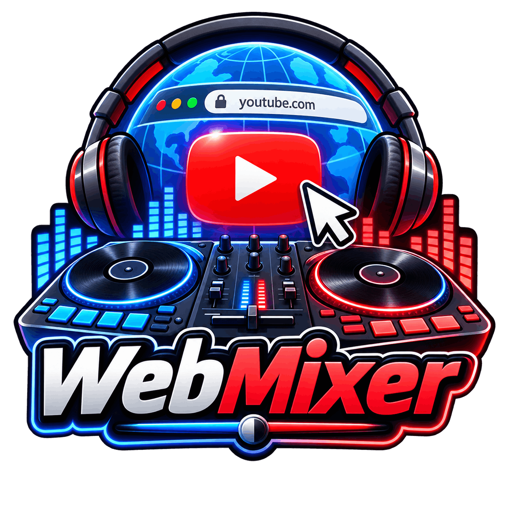
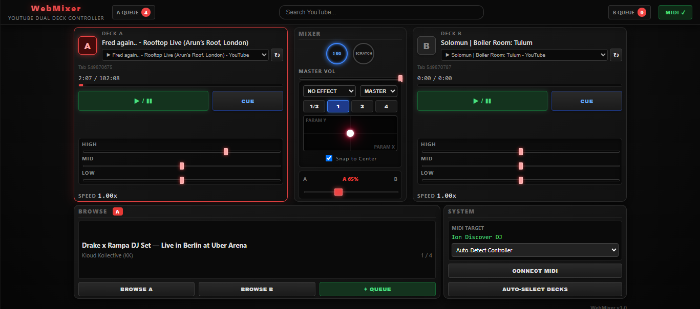
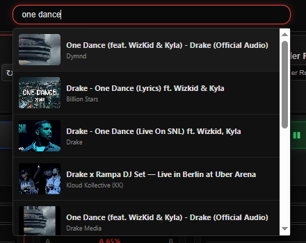
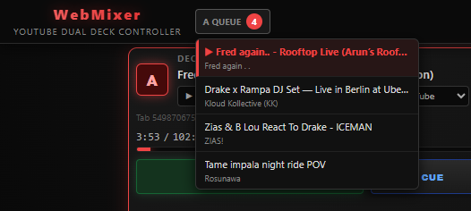
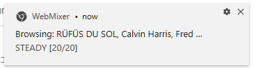
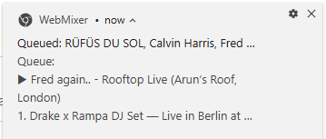

# WebMixer Extension

  

**A Chrome Extension that turns standard hardware DJ Controllers into powerful YouTube dual-deck mixers.**

## Purpose

This extension allows DJs to plug in affordable or professional MIDI controllers and mix music *directly* from active YouTube tabs in the browser. You no longer need to download MP3s or use complex software like Rekordbox or Serato if you just want to jam to tracks on YouTube. 

The extension injects a content script into YouTube tabs that controls playback, speed, and seeking with high precision, all controlled via your hardware mixer in real-time.

## Features

- **Dual Deck Control:** Route two different YouTube tabs to Deck A and Deck B.
- **Hardware Integration:** Supports Play/Pause, Cue, Jog wheels (Scratch & Pitch Bend), Crossfader, and EQs.
- **2-Band / 3-Band EQ:** Choose between Treble/Bass or High/Mid/Low mixing.
- **Effects Pad:** Apply browser-based audio effects like Echo, Flanger, and Reverb using an XY Pad.
- **Drag-and-Drop Queue:** Search YouTube directly from the DJ console and drag videos into your queue.
- **Background Operation:** Mix, scratch, play, and browse tracks from your controller fully in the background, as long as the extension UI remains open in a background tab.
- **Modular MIDI Architecture:** A generic routing engine that easily supports any MIDI controller by editing `midi_mappings.js`.

## Screenshots

### Main Console
The main DJ console UI, featuring dual decks, EQs, effects, and a crossfader.

### YouTube Search Panel
Search for any YouTube video directly within the mixer to find your next track.

### Track Queue
Organize your upcoming tracks. You can build your setlist on the fly. Note that the queue is maintained independently per deck (i.e., for each of the two chosen tabs).

*Note: Selected search results can be dragged and dropped directly to a deck or to the queue.*

### Background Notifications
Even when you don't have the extension UI open, you can still use your controller's browse knob to search for new tracks. A notification will display your search results:

When you successfully add a track to the queue via the controller, you'll see a notification confirming the addition, along with what is currently playing and what's up next:

## Supported Hardware Controllers

The extension uses the Web MIDI API to auto-detect hardware. It supports the following controller families natively:

- **ION Discover DJ** (Primary default mapping)
- **Pioneer DDJ Family:** DDJ-FLX4, DDJ-400, DDJ-SB2, DDJ-SB3, DDJ-RB, DDJ-SX, DDJ-SX2, DDJ-1000, DDJ-800
- **Numark Mixtrack Family:** Mixtrack Pro, Platinum
- **Hercules DJControl Family**
- **Traktor Kontrol Family:** Kontrol S2

*Note: For controllers other than the ION Discover DJ, the extension currently maps the standard Play, Cue, and Jog functions based on official Mixxx MIDI specifications. If your controller uses non-standard CCs for EQs or Faders, the extension includes a built-in "MIDI Learn" logger in the background service worker console to help you easily add missing hex codes to `midi_mappings.js`.*

## Installation

1. Clone or download this repository.
2. Open Google Chrome and navigate to `chrome://extensions/`.
3. Enable **Developer mode** in the top right corner.
4. Click **Load unpacked** and select the folder containing this extension.
5. Click the extension icon in your toolbar to open the DJ UI.
6. Plug in your MIDI controller via USB. The system will auto-detect it and the status will change to "CONNECTED".

## Architecture

*   **`dj.html` & `dj.js`**: The DJ Console UI, rendering state, rendering queues, and receiving user interaction.
*   **`background.js`**: The central Service Worker that maintains the unified application state, handles routing MIDI to YouTube tabs, and broadcasts state updates to the UI.
*   **`midi_mappings.js`**: Contains the `ControllerMappings` array. This file acts as the translator, taking raw hardware MIDI bytes and returning standard software Actions (e.g., `[0x90, 0x0B, 0x7F]` -> `{action: "PLAY_PAUSE", deck: "A"}`).
*   **`content.js`**: Injected into YouTube tabs. Finds the `<video>` element, applies `AudioContext` nodes for equalization and effects, and listens for playback commands.
